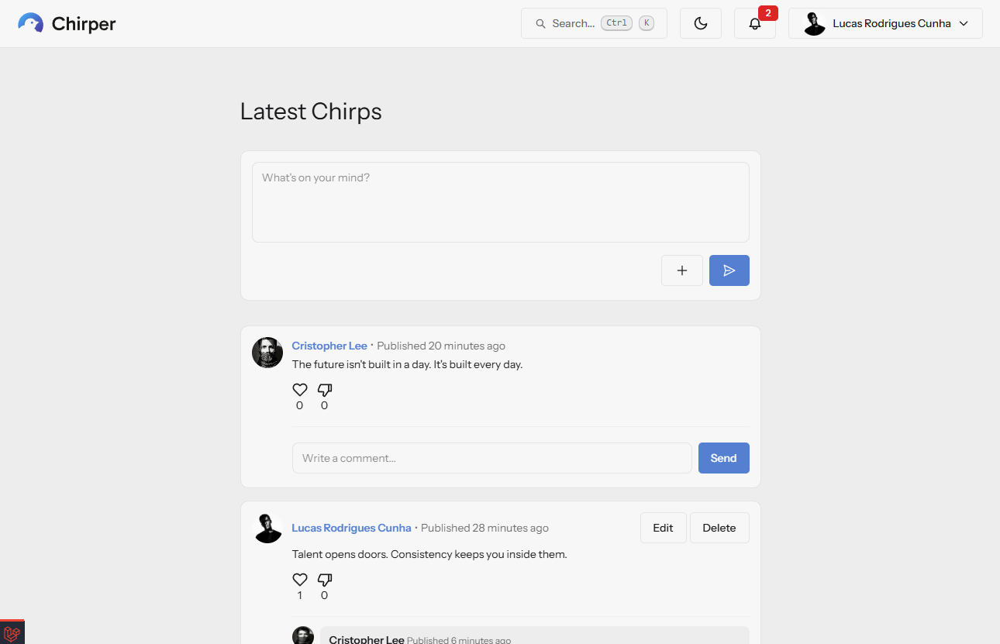

# Chirper Together




Twitter-style social mini-network built with Laravel 12. Users post short chirps, follow each other, comment, react with like/dislike, and get notified when others interact with their content.

Live: [chirper-master-ej8kbb.laravel.cloud](https://chirper-master-ej8kbb.laravel.cloud)

## Stack

- **Backend**: Laravel 12, PHP 8.2+
- **Frontend**: Blade components, Vite 7, TailwindCSS 4, DaisyUI 5
- **Database**: SQLite (default), MySQL/PostgreSQL compatible via Eloquent
- **Testing**: Pest 4 + pest-plugin-laravel; SQLite `:memory:` for fast feature tests
- **E2E**: Playwright
- **Deploy**: Laravel Cloud — Flex 256 MiB compute (US East / Ohio), Serverless Postgres 17 (¼ unit), edge network with DDoS protection + CDN + edge caching

## Features

| Area | Highlights |
|------|-----------|
| Auth | Register, login, email verification, password reset |
| Chirps | Create, edit (owner), delete, optional file attachment, like/dislike reactions |
| Comments | Threaded under chirps, inline edit, owner delete, like/dislike |
| Follow | Follow/unfollow users; counters on profile |
| Profile | Public `/users/{user}` page with avatar, bio, chirp list, follower counters |
| Search | Find chirps and users by name/email/message with LIKE-wildcard escaping |
| Command palette | `Ctrl/Cmd+K` opens a debounced live-suggest modal hitting `/search/suggest` for users + chirps, with "see all results" fallback |
| Notifications | Database channel for new followers, comments, and likes; navbar bell with unread badge |
| Access control | Home, search, and notifications gated behind `auth` + `verified` middleware |
| Theme | Light/dark toggle (DaisyUI `theme-controller`) with `localStorage` + `prefers-color-scheme` |
| UX polish | Live character counters on textareas, long-word wrapping, DaisyUI numbered pagination |

## Project layout

```
app/
  Http/Controllers/      Chirp, Comment, Follow, Like, Notification, Search, User
  Notifications/         NewFollower, NewComment, NewLike (database channel)
  Models/                User, Chirp, Comment, Like, Follow, ChirpAttachment
database/migrations/     Users, chirps, likes, comments, follows, notifications, ...
resources/
  views/                 Blade pages + chirps/comments components
  js/                    charCounter, commentEdit, userReaction, sendChirpAttachment, commandPalette
  css/app.css            laravelChirper + laravelChirperDark DaisyUI themes
routes/                  Split per resource: web, auth, chirps, comments, follows,
                         users, search, notifications, password, profile, verification
tests/Feature/           Pest feature tests (auth, chirps, comments, follows, ...)
tests/e2e/               Playwright specs + global-setup + helpers
app/Console/Commands/    E2eResetCommand (php artisan e2e:reset)
```

## Setup

```bash
git clone <repo> chirper
cd chirper
composer install
cp .env.example .env
php artisan key:generate
touch database/database.sqlite
php artisan migrate --seed
npm install
npm run build
php artisan serve
```

Or use the composer shortcut: `composer setup`.

For local dev with hot reload (server + queue + Vite in parallel):

```bash
composer dev
```

## Testing

PHP feature tests (Pest):

```bash
./vendor/bin/pest
# or
composer test
```

E2E tests (Playwright):

```bash
npm run test:e2e            # headless, record video per test
npm run test:e2e:headed     # watch the browser drive itself
npm run test:e2e:ui         # interactive UI mode (best for debugging)
npm run test:e2e:codegen    # record clicks and emit a new spec
```

The Playwright config auto-starts `php artisan serve --port=8000`. A
`globalSetup` hook builds Vite assets (when missing) and runs `php artisan
e2e:reset` to drop the database and seed two verified users
(`alice@e2e.test` / `bob@e2e.test`, password `password123`) plus baseline
chirps. A per-test fixture re-seeds before every spec so tests never
collide on shared state.

Videos and traces land under `test-results/<test-name>/`. The HTML
report is available with:

```bash
npx playwright show-report
```

Suites cover auth, chirps CRUD + reactions, comments CRUD + reactions,
follow/unfollow, navbar and dedicated search, and profile editing.

## Notifications

Three notification types are dispatched on the `database` channel:

- `NewFollowerNotification` — sent on first follow (no spam on repeat clicks)
- `NewCommentNotification` — sent to chirp owner when a different user comments
- `NewLikeNotification` — sent to chirp owner on new reaction or reaction type change; self-reactions are silent

The navbar bell shows unread count; visiting `/notifications` marks everything read.

## Themes

Two DaisyUI themes are defined in `resources/css/app.css`: `laravelChirper` (light) and `laravelChirperDark` (dark). Selection is persisted in `localStorage` and applied via an inline `<script>` in `<head>` before paint to avoid flashes.
